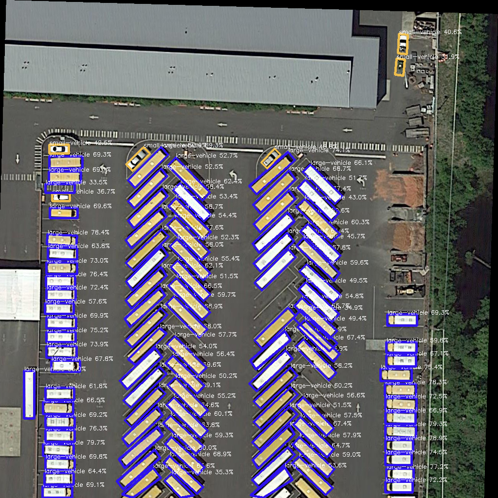

# GGHL-Deployment

初步计划实现对以下平台的推理，分别是
- NCNN(完成）
- openvino（无AVX512）
- tensorrt（实现）
- onnxruntime(python API)
## TensorRT
- FP-16 load image 16.32ms
- FP-16 nms 48.32ms
- FP-16 inference 5ms
## NCNN
- PNNX(转换已完成)
- 推理已完成
- 解码完成

## 更新
我们发现有些情况中，onnx->trt转换时会出现段错误的情况，解决的方式是使用英伟达官方的
转换工具`\trtexec`，通过分配尽可能的maxworkspace来减少这种情况的出现
## 命令行解析的支持
GGHL-Deployment 命令行解析的支持，目前您可以指定输入的图片，来获取解析后图片的表征图片
- 引擎文件的选择
- 精度的选择
- 解耦模式的选择
## 解耦头
原版的GGHL是有解耦头，直接省略了cpp后端的解码的过程，但是由于ScatterNd以及过多的算子影响了GGHL在不同框架的推广范围，我们更新了新的部署的方式，在原有的基础上，我们可以在不重新训练模型的基础上实现旋转框的解译
```C++
   decode_infer(original_result, grid,convert_middle);
   // convert_result(original_result,convert_middle);
```
利用的decode_infer原来的convert_result,实现解耦头的推理。
